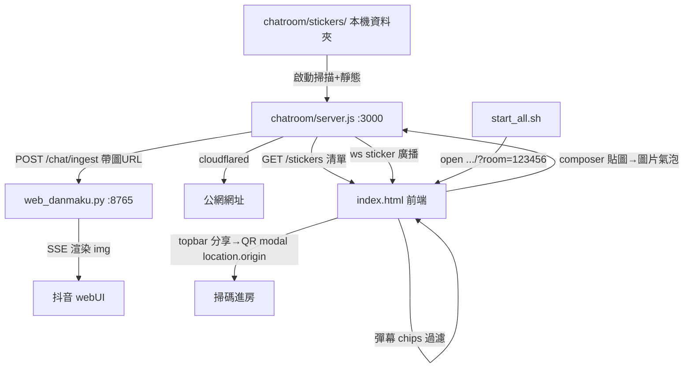

# Chatroom 四項功能設計（2026-06-04）

> 對 `chatroom/`（聊天室）與 `web_danmaku.py`（抖音彈幕 webUI）新增 4 項功能。
> 狀態：設計確認中 → 待 user review → writing-plans。

## 背景與目標

整合專案有兩個服務（見 `docs/INTEGRATION.md`）：

- `web_danmaku.py`（本機 :8765）：抖音彈幕主控台 webUI，自己看。
- `chatroom/`（本機 :3000 → cloudflared 公網）：朋友用的聊天室，房內可看抖音彈幕。

本次新增 4 項需求：

| # | 需求 | 主要改動檔案 | 現況 |
|---|------|------------|------|
| 1 | 啟動自動開「聊天室公網分頁」並進 123456 房 | `start_all.sh` | 只開了 webUI，聊天室分頁沒開 |
| 2 | 聊天室加「分享」鈕 → QR code 掃碼進房 | `chatroom/public/index.html` + vendored QR lib | 無 |
| 3 | 彈幕可選擇顯示的分類（chips 過濾） | `chatroom/public/index.html` | 無，5 類全顯示 |
| 4 | 貼圖功能（本機資料夾放圖，房內共用，鏡像到 webUI） | `chatroom/server.js` + `index.html` + `web_danmaku.py` | 無 |
| 5 | 貼圖批次重命名工具（雜亂檔名 → 有序 001/002…） | `chatroom/scripts/rename-stickers.mjs` + `package.json` | 無 |

## 跨需求關鍵連動（#1 ↔ #2）

QR（#2）編碼的網址 = `location.origin + '/?room=' + roomCode`。
因此 #1 自動開的「聊天室分頁」**必須是公網網址**，否則 `location.origin` 會是 `localhost`，朋友/中國掃了連不到。

```
#1 自動開公網分頁  ==>  location.origin = 公網  ==>  #2 QR 直接正確
                                                     （零額外 server 改動）
```

降級：cloudflared 取不到公網網址時，#1 fallback localhost、#2 的 QR 也只能同機/同網段掃（已與 user 確認可接受）。

## 架構（更新後資料流）

```
chatroom/stickers/   (你本機丟貼圖的資料夾，不進 git)
      |  server 啟動掃描 + 靜態服務
      v
+---------------------------------------------+
|  chatroom/server.js  (:3000)                 |
|  · 既有：房間 WS / 彈幕 SSE 訂閱 / 訊息鏡像     |
|  · 新增 GET /stickers      → 貼圖檔名清單 JSON |   #4
|  · 新增 GET /stickers/*    → 貼圖靜態檔        |   #4 (補圖片 MIME)
|  · 新增 ws 'sticker' 事件  → 廣播房內 peers    |   #4
|  · 貼圖鏡像 POST :8765 /chat/ingest (帶圖 URL)|   #4
+---------------------------------------------+
      |  cloudflared 隧道                         \  鏡像（含貼圖小圖）
      v                                            v
   公網網址                              +---------------------------+
      |  start_all.sh open .../?room=123456  | web_danmaku.py (:8765)    |  #1
      v                                   | · /chat/ingest 收 sticker_url|  #4
  chatroom/public/index.html (前端)        | · webUI SSE 渲染        |  #4
   +-- topbar [分享] → QR modal            +---------------------------+
   |     (location.origin + ?room=)   #2
   +-- 彈幕區 [✓聊天][✓禮物]… chips   #3
   +-- composer [貼圖] → grid 面板    #4
         → 送 sticker → 圖片氣泡
```



---

## 需求 #1：啟動自動開聊天室公網分頁

**問題**：`start_all.sh` 結尾雖有 `open "$PUBLIC_URL/?room=$ROOM"`，但實測只開了 webUI。最可能原因：cloudflared 未安裝 / 隧道未就緒時 `PUBLIC_URL` 為空，或 `open` 時機過早。

**設計**：
- 實作時先 debug 確認 `PUBLIC_URL` 取得與 `open` 執行狀況（加可見回饋，移除把錯誤吞掉的 `2>&1`，或印出實際要開的 URL）。
- 確保啟動後自動開**公網聊天室分頁** `<PUBLIC_URL>/?room=123456`；公網取不到才降級 `http://localhost:3000/?room=123456`。
- 前端 `autoJoin` 邏輯（`index.html:645-648, 547-551`）已正確，不動。

**驗收**：跑 `./start_all.sh`，瀏覽器自動跳出聊天室公網分頁且已在 123456 房（topbar 房號顯示 123456）。

---

## 需求 #2：分享鈕 + QR modal

**UI**：topbar 在「鎖定房間」旁加「分享」鈕 → 點擊彈出 modal：
- QR code（內容 `location.origin + '/?room=' + state.roomCode`）
- 網址文字
- 「複製網址」鈕（`navigator.clipboard`，失敗降級 `execCommand`）
- 「關閉」鈕（點遮罩或關閉鈕關閉）

**QR library（中國約束：不可走 CDN）**：
- vendored `kazuhikoarase/qrcode-generator`（MIT、純 JS、無依賴、~5KB）到 `chatroom/public/vendor/qrcode.min.js`，本機載入。
- 渲染為 SVG 或 table（避免 canvas 在某些環境字型問題）。

**改動範圍**：純前端（`index.html` + 新增 `public/vendor/qrcode.min.js`）。server 不動。

**驗收**：點分享 → 顯示 QR；手機掃碼開啟 → 自動進入同一房號。

---

## 需求 #3：彈幕分類 chips 過濾

**彈幕分類**（既有 5 類）：`chat` 聊天 / `gift` 禮物 / `member` 進場 / `social` 關注 / `like` 讚。

**UI**：彈幕區頂部（`danmaku-head`）加一排 chips，預設全開；點 chip 切換該類顯示/隱藏（視覺以 active class 表示）。

**邏輯**：
- `state.danmakuFilter`：`{ chat:true, gift:true, member:true, social:true, like:true }`。
- `addDanmaku`：渲染時帶 `data-dtype`；該類被關 → 加 `hidden` class（用 CSS `display:none`，保留 DOM 以便重新開啟立即顯示，與既有 300 筆上限相容）。
- 切換 chip → 重掃現有彈幕行套用/移除 `hidden`（仿 `rescanHighlight`，`index.html:485`）。
- localStorage 記憶（key `chatroom:danmakuFilter`），仿既有 `remember/recall`。

**改動範圍**：純前端（`index.html`）。server 不動。

**驗收**：關掉「禮物」→ 禮物彈幕即時消失，再開即時恢復；重整後設定保留。

---

## 需求 #4：貼圖功能

### 資料夾與格式
- 路徑：`chatroom/stickers/`（你本機丟圖）。
- 格式：`.png .jpg .jpeg .gif .webp`（含 GIF 動圖）。
- Git：`chatroom/stickers/*` 加入 `.gitignore`，保留 `.gitkeep` + 1–2 張範例 + `README` 說明放圖方式（貼圖不進 git，與 user 確認）。

### server.js
- 補圖片 MIME types（png/jpg/jpeg/gif/webp）。
- `GET /stickers`：`readdir(stickers 目錄)`，過濾合法副檔名，回傳 `{ stickers: ["a.png", ...] }`。
- `GET /stickers/*`：靜態服務貼圖檔（沿用既有目錄穿越防護，限定 stickers 目錄）。
- ws `sticker` 事件：
  - client 送 `{ type:'sticker', name:'a.png' }`，server 驗證 name 在清單內（防注入），廣播 `{ type:'sticker', name, sender, ts }` 給房內 peers（不回送自己，前端 optimistic 顯示，與 message 一致）。
  - `handleClientMessage` 加 `case 'sticker'`。
- 鏡像到 webUI：`forwardToDanmaku` 擴充，貼圖時 POST `/chat/ingest` 帶 `{ room, name, text:'[貼圖]', sticker_url:'http://127.0.0.1:<PORT>/stickers/<name>' }`（webUI 與 chatroom 同機，用 127.0.0.1）。

### index.html
- composer 加「貼圖」鈕 → 點擊彈出 grid 面板（`fetch('/stickers')` 載入，縮圖網格）。
- 點貼圖 → `send('sticker', { name })` + optimistic `addStickerMessage(mine)`，關閉面板。
- `handlers.sticker` → `addStickerMessage(peer)`。
- `addStickerMessage`：氣泡內 `">`（限定寬高、保留圓角），沿用 me/peer row 樣式與連續分組。

### web_danmaku.py（鏡像顯示小圖）
- `/chat/ingest`（`web_danmaku.py:1354`）：解析新增 `sticker_url`，broadcast 的 event 帶上。
- webUI 渲染（`web_danmaku.py:838` 附近 render row）：event 有 `sticker_url` → 該行渲染 ``（限高、`escapeHtml` 仍套用文字部分；URL 僅允許本機 `127.0.0.1:<chatport>/stickers/` 前綴，防注入）。

**驗收**：把圖放進 `chatroom/stickers/` → 重啟 → 聊天室貼圖面板出現該圖 → 房內 A 貼圖，B 即時看到圖片氣泡 → 抖音 webUI「聊天室」分類也顯示同一張小圖。

---

## 需求 #5：貼圖批次重命名工具

**目的**：把丟進 `chatroom/stickers/` 的雜亂檔名（`IMG_1234.jpg`、`截圖.png`…）批次整理成有序檔名，讓貼圖面板顯示順序穩定可預測。

**工具形式**：
- `chatroom/scripts/rename-stickers.mjs`（Node ESM，與 `chatroom` 的 `type:module` 一致）。
- `package.json` 加 `"stickers:rename": "node scripts/rename-stickers.mjs"`，用 `npm run stickers:rename` 執行。

**行為**：
- 掃描 `chatroom/stickers/` 內合法圖片（`.png .jpg .jpeg .gif .webp`），略過 `.gitkeep` / `README` / 非圖片。
- **排序依據：mtime 升序**（先加入資料夾的排前面，與「陸續新增貼圖」直覺一致）。
- 重命名為 `001.<原副檔名>`、`002.<原副檔名>`…（**補零 3 位**、**保留各自原副檔名**、副檔名轉小寫 `.PNG→.png`）。上限 999（足夠；超過時 spec 再議）。
- **兩階段改名防碰撞**：先全部改成臨時名（`.rename-tmp-<n>.<ext>`），再改成最終名，避免 `002→001` 覆蓋既有 `001`。
- **冪等**：重複執行結果穩定（已整齊的維持原序）。
- 印出 `old → new` 對照表與總數。

**改動範圍**：新增腳本 + `package.json` 一行 script。不影響 runtime。

**驗收**：放入數張雜亂檔名圖 → `npm run stickers:rename` → 變 `001.* 002.* …` 按加入時間排序；重跑結果不變；`.gitkeep`/`README` 不被動到。

---

## 已定決策清單

1. #1 自動開**公網**分頁（非 localhost），讓 #2 QR 用 `location.origin` 天然正確。
2. #2 QR lib **vendored** 本機（中國不可 CDN）。
3. #3 過濾用 `display:none` 保留 DOM（可即時切換、相容 300 筆上限）。
4. #4 貼圖檔**不進 git**（repo 只留範例 + 說明）。
5. #4 貼圖**鏡像到 webUI 且顯示小圖**（改 `web_danmaku.py`）。
6. 貼圖 name 一律**白名單驗證**（限 stickers 目錄實際檔案），URL 限 `127.0.0.1` 前綴，防路徑穿越 / 注入。
7. #5 重命名**按 mtime**、保留原副檔名（轉小寫）、補零 3 位、兩階段防碰撞、冪等；手動執行不自動跑。

## 測試計畫

- #1：手動跑 `./start_all.sh` 觀察自動開分頁與房號。
- #2：桌機顯示 QR + 手機實掃進房。
- #3：逐類開關 + 重整保留。
- #4：放圖→面板顯示→房內互傳→webUI 鏡像顯示圖；異常檔名/路徑穿越被擋。
- #5：雜亂檔名→`npm run stickers:rename`→按 mtime 變 001/002…；重跑冪等；`.gitkeep`/`README` 不動。
- 既有功能回歸：建房/進房/鎖房/打字中/彈幕 SSE/訊息鏡像 不受影響。

## 風險與降級

| 風險 | 降級 |
|------|------|
| cloudflared 未裝 / 隧道失敗 | #1 開 localhost、#2 QR 為 localhost（同機可掃） |
| 貼圖檔過大拖慢載入 | 面板 lazy-load、單檔大小於 README 建議上限（如 ≤ 2MB） |
| webUI 跨埠載入貼圖圖片失敗 | webUI 該行 fallback 顯示 `[貼圖]` 文字 |
| 貼圖檔名含特殊字元 | server/前端 `encodeURIComponent` + 白名單驗證 |
| #5 重命名後歷史貼圖訊息圖失效（指向舊檔名） | 訊息無持久化、重整即消，影響小；建議**開房前**先整理 |
| #5 兩階段改名中途中斷 | 殘留 `.rename-tmp-*` 可重跑修復；腳本啟動先清掉舊 tmp |
